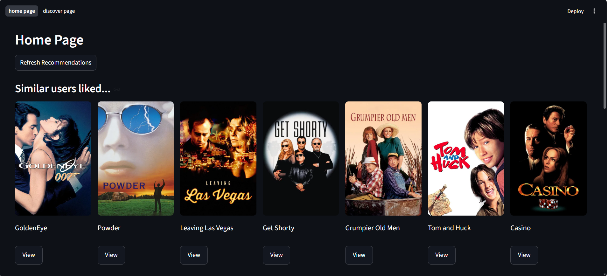
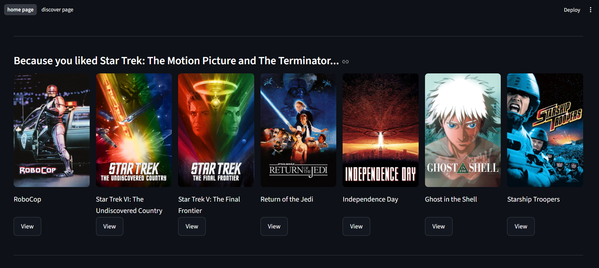
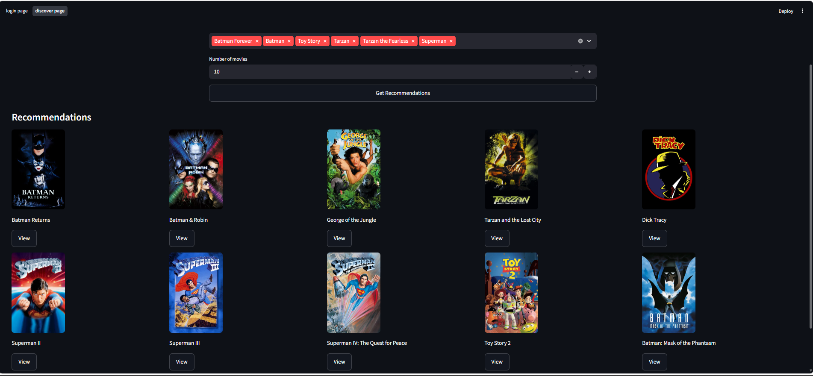
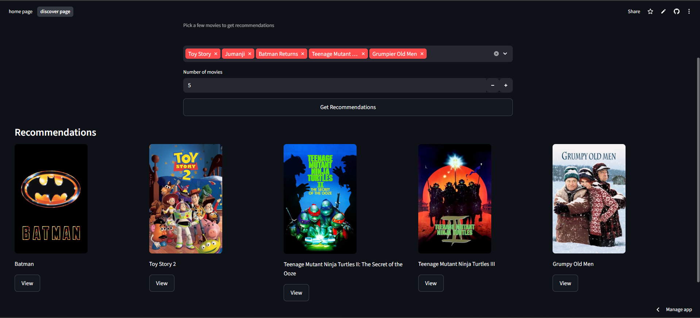

# 🎬 MovieArsenal — Hybrid Movie Recommendation System (Parallel Hybrid)

A **movie recommendation system** that uses **Collaborative Filtering** (user behavior), **Content-Based Filtering** (movie similarity), and **popularity-based ranking** — presented as separate recommendation streams in a Streamlit UI.

---

## Demo








---

## Features

- **Collaborative Filtering recommendations** — personalised suggestions using Matrix Factorization  
- **Content-based recommendations** — TF-IDF on movie metadata (genre, cast, director, keywords, overview) + cosine similarity  
- **Popularity-based recommendations** — weighted ranking using rating count and average rating  \
- **Preference-based recommendations** — users select movies to receive similar recommendations based on their choices
- **Interactive UI** with movie detail dialogs  


---

## Architecture

```
User selects movies / enters User ID
              ↓
   ┌──────────────────────────┐
   │   Collaborative Filter   │  Matrix Factorization (dot product + biases)
   │   MovieLens 1M ratings   │  Manual numpy matrix multiply for inference
   └──────────────────────────┘
            and
   ┌──────────────────────────┐
   │   Content-Based Filter   │  TF-IDF on title, genre, cast, director,
   │   MovieLens + TMDB data  │  keywords, overview → cosine similarity
   └──────────────────────────┘
              ↓
       Streamlit UI
   
   Home Page:

   Row 1: "Users Like You Also Loved"   ← Collaborative Filtering
   Row 2: "Because You Watched These"   ← Content-based
   Row 3: "Popular Movies"   ← Popularity-based ranking
   

   Discover Page: Cold-start CB         ← No login required
```

---

## Model Performance

| Model | Val RMSE | Val MAE | R² |
|---|---|---|---|
| Matrix Factorization | 0.903 stars | 0.713 stars | 0.343 |
| Neural Collaborative Filtering | 0.889 stars | 0.699 stars | 0.364 |

NCF shows marginal improvement (~0.014 stars). Since MovieLens 1M is relatively small and clean, the additional complexity of NCF doesn't justify the slower inference. **Matrix Factorization was chosen for the final system.**

---

## Key Technical Decisions

### Why Matrix Factorization over NCF?
NCF (dot product path + MLP path) gave 0.014 star improvement in RMSE. For a real-time UI where inference speed matters, the marginal gain didn't justify the additional complexity. Both models are in the notebooks for comparison.

### Why z-score standardization for ratings?
Without dividing by std, the target range is asymmetric (~-2.5 to 1.4). With z-score, targets are symmetric around 0. This gives the model a balanced starting point — predictions start near 0, targets are centered near 0, so gradients are stable from the first epoch and biases don't dominate training.

### Why no regularization on bias embeddings?
Bias embeddings capture real signal — "user 42 always rates 0.8 above average" or "this movie is universally loved." Penalizing them with L2 would shrink this toward zero, destroying legitimate information. Only the user/movie latent factor embeddings are regularized.

---

## Known Limitations

- **Dataset ends at year 2000.** MovieLens 1M was collected in 2000-2001 and contains no movies after that year. This is a dataset limitation, not a model limitation. The architecture supports updating to a newer dataset — new movies can be added via embedding fine-tuning without full retraining (see `02-add_new_users_movies_to_the_model.ipynb`).
- **Extensibility:** The system is designed to support adding new users and movies via embedding fine-tuning without full retraining. This capability is demonstrated in the notebooks but not exposed in the UI.

---

## Future Improvements

- Add user onboarding and persistence to support real-time user ingestion  
- Enable online updates for new users and movies via incremental embedding training

---

## Highlights

- Reduced TF-IDF storage from **1.3GB → ~1.4MB** using sparse matrices  
- Real-time recommendations using vectorized inference (no model.predict overhead)  

---

## Project Structure

```
├── app/
│   ├── app.py                  # Main Streamlit app — routing and shared state
│   ├── home_page.py            # Personalised recommendations for logged-in users
│   ├── discover_page.py        # Cold-start page — no login required
│   └── recommender.py          # All recommendation logic
│
├── notebooks/
│   ├── 01-user-item-matrix-prep-collaborative.ipynb   # CF model training (MF + NCF)
│   ├── 02-retraining_for_new_users_and_movies.ipynb   # Fine-tuning for new entities
│   ├── 03-matching_ML_id_with_TMDB_id.ipynb           # MovieLens ↔ TMDB ID mapping
│   ├── 04-content-based-movie-recommender.ipynb       # TF-IDF content-based model
│   ├── 05-cold_start_content_based_recommender.ipynb  # Cold-start recommender
│   ├── 06-popular_movies.ipynb                        # Popular movies baseline
│   └── 07-preparing_combined_data.ipynb               # Data pipeline
│
├── models/
│   ├── tf/                     # Trained Keras models (v1–v6 + final)
│   ├── artifacts/
│   │   ├── mappings/           # ID maps, reverse maps, held-out sets
│   │   ├── matrices/           # TF-IDF matrix
│   │   └── stats/              # global_mean.npy, global_std.npy
│
└── data/
    ├── raw/MovieLens 1M/       # Original dataset
    └── processed/              # Cleaned and merged data with TMDB metadata
```

---

## How to Run

```bash
# 1. Clone the repo
git clone https://github.com/yourusername/moviearsenal
cd moviearsenal

# 2. Create virtual environment
python -m venv venv
source venv/bin/activate  # Windows: venv\Scripts\activate

# 3. Install dependencies
pip install -r requirements.txt

# 4. Run the app
cd app
streamlit run app.py
```

**Login with any User ID from 1 to 6040**, or use the Discover page without logging in.

---

## Tech Stack

| Component | Technology |
|---|---|
| Collaborative Filtering | TensorFlow / Keras — Matrix Factorization with embedding layers |
| Content-Based Filtering | scikit-learn — TF-IDF vectorizer + cosine similarity |
| Data | MovieLens 1M + TMDB metadata via TMDB API |
| UI | Streamlit |
| Language | Python 3.12 |

---

## Dataset

- **MovieLens 1M** — 1,000,209 ratings from 6,040 users on 3,706 movies (GroupLens Research)
- **TMDB metadata** — fetched via TMDB API for each MovieLens movie (genres, cast, director, keywords, overview, poster URLs)
